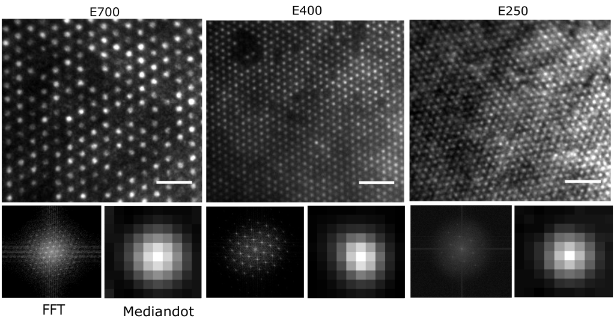
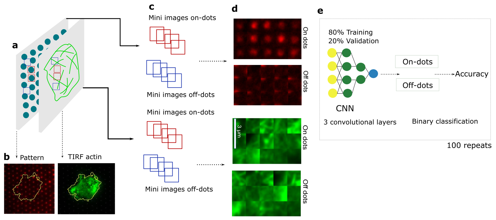

# Ligand nano-cluster array enables AI based detection of hidden features in T cell architecture

 

Protein-patterning has emerged as a powerful means to interrogate adhering cells. Yet, there are no standard tools to apply a sub-micron periodic stimulus or to analyse the response. We propose a technique combining electron-beam lithography and surface functionalization to fabricate nano-patterns compatible with advanced imaging. The repetitive pattern enables a deep-learning algorithm to reveal that T cells organize their membrane and actin network differently depending on whether the ligands are clustered or homogeneously distributed an effect invisible to the unassisted human eye even after extensive image analysis. Our integrated fabrication and analysis tool-box should be useful for exploring general correlation between a spatially-structured sub-cellular stimulation and the cellular response.

*Figure 3: a. Schematic for generation of the mini-images of actin. Red(blue) squares correspond to on- (off-) dot zones. b. Epi-fluorescent image of the pattern and TIRF image of actin of a cell on the pattern. c,d. Schematic and real example of mini-images on- or off-dot. e. Schematic of the working of the image classifier.*
